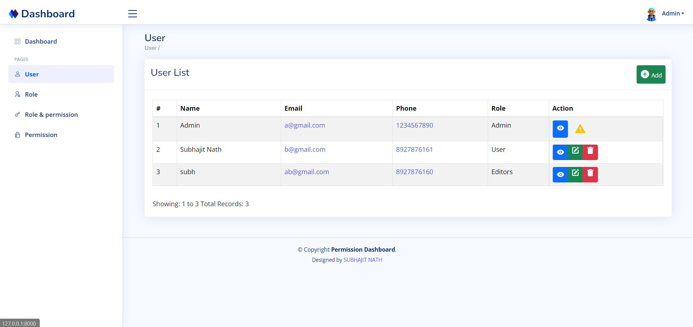
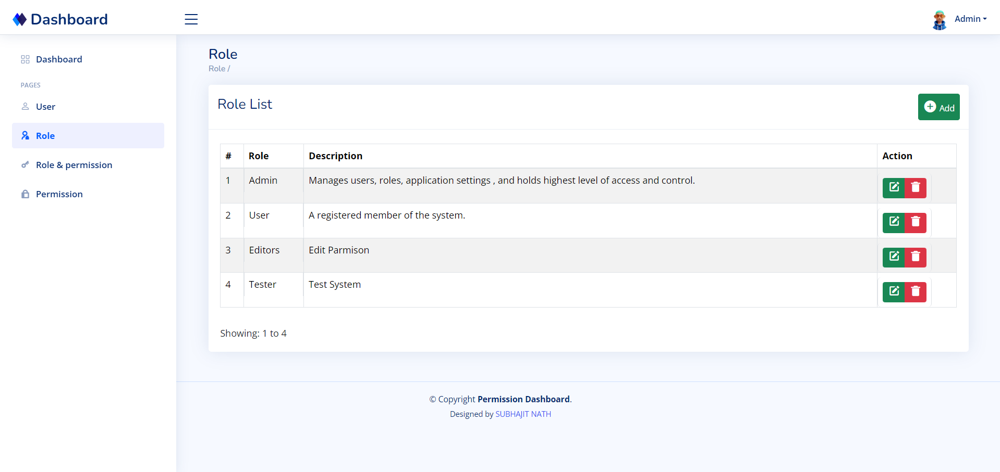
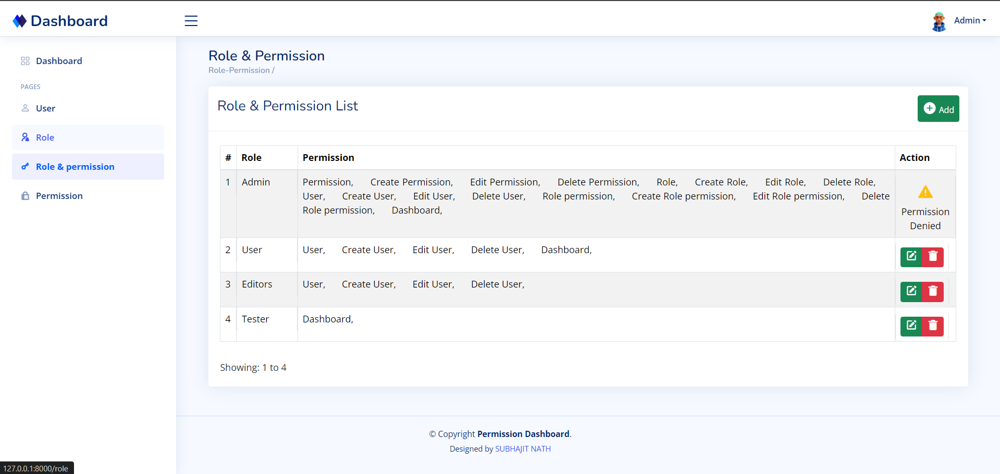
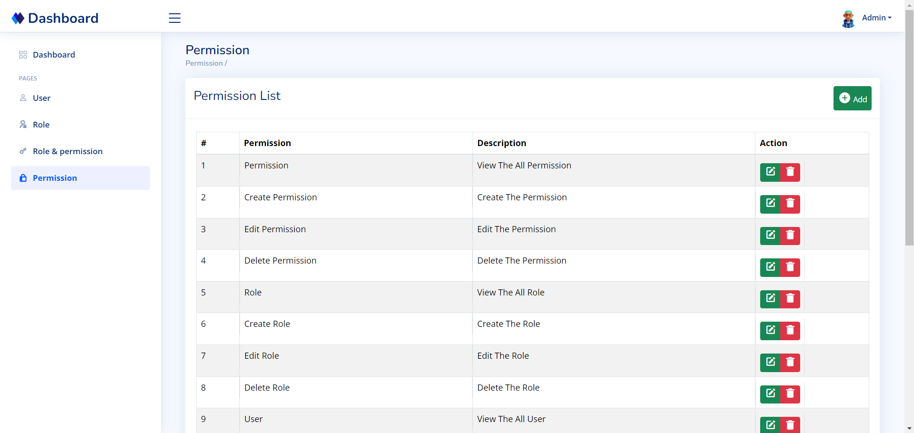
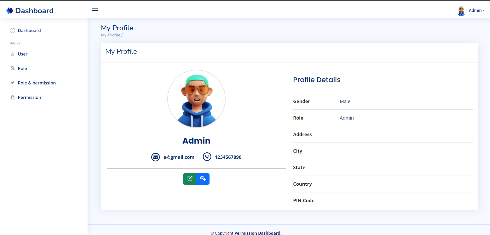
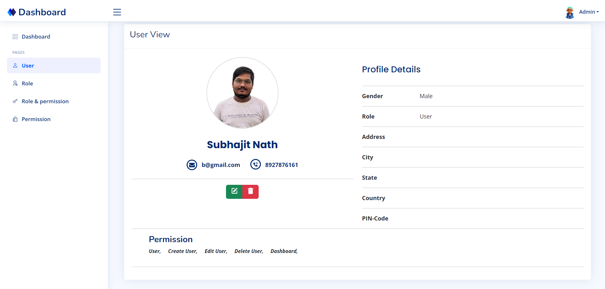

# Laravel User Role Permission Management


#### Description
The Laravel User Role Permission Management system is designed to provide an efficient and scalable way to manage user roles and permissions within a Laravel application. This system allows administrators to create and assign roles to users, and to define specific permissions for each role. With this solution, you can ensure that users have appropriate access levels based on their assigned roles, enhancing the security and functionality of your application.


## Features
- **User Creation and Profile:** Create users and manage their profiles efficiently.
- **Role Creation and Management:** Create, edit, and delete user roles easily.
- **Permission Creation and Management:** Create, edit, and delete user permission easily.
- **Role-based Permission Assignment:** Assign, edit, and delete permissions for roles to control access effectively.
- **User Role Assignment:** Assign roles to users, allowing for dynamic and flexible access control.
- **Role Hierarchy:** Support for hierarchical roles, allowing for inheritance of permissions.
- **User Interface:** User-friendly interface for managing roles and permissions.
- **Dynamic Navigation Bar:** Adjusts based on user role permissions, providing a tailored navigation experience.
- **Permission Restrictions:** Users cannot assign roles equal to or higher than their own. Roles and permissions assigned at the creation time are the only users can carry or access.


## Technologies
- **Laravel Framework**
- **MySQL Database**
- **Blade Templating Engine**
- **Bootstrap for UI**
- **jQuery DataTables**
- **Ajax API**
- **Font Awesome**


## Installation
**Clone the repository** 
 ```sh
   git clone https://github.com/subhajitnath0/Laravel-User-Role-Permission-Management.git
 ```
 **Navigate to the project directory** 
 ```sh
   cd Laravel_Admin_Role_Permission
 ```
 **Install dependencies** 
 ```sh
   composer install
   npm install
 ```
 **Create a copy of the .env file** 
 ```sh
   cp .env.example .env
 ```
 
 **Generate an application key** 
 ```sh
   php artisan key:generate
 ```
 **Configure your database in the .env file**
 
 **Run the migrations**
 ```sh
   php artisan migrate
 ```
 **Seed the database**
 ```sh
    php artisan db:seed
 ```
 **Run the development server**
 ```sh
    php artisan serve
 ```
 
**Open the application in your browser**
    **http://localhost:8000**


## Default Admin Login Credentials

**Default Admin Login ID:** ```a@gmail.com```

**Default Admin Password:** ```123456```


## User List


## Role List


## Role & Permission List


## Permission List


## My Profile


## User View



## Contact Information

- LinkedIn: [Subhajit Nath - LinkedIn](https://www.linkedin.com/in/subhajitnath/)

- GitHub: [Subhajit Nath - GitHub](https://github.com/subhajitnath0)

- Instagram: [Subhajit Nath - Instagram](https://www.instagram.com/subhajitnathsubhajitnath/)